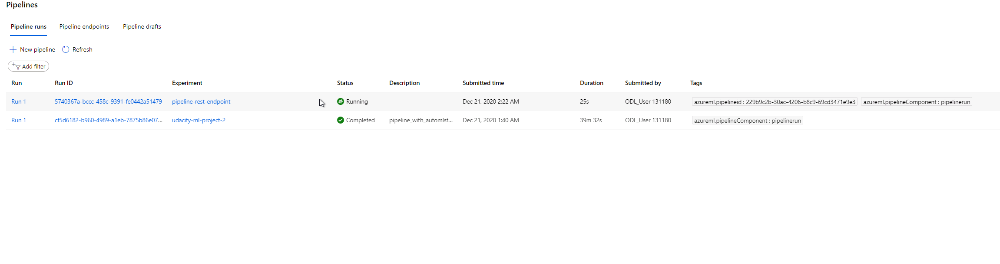

# Operationalizing Machine Learning Pipelines

In this project, I started working with Bank Marketing dataset. I then used Azure to configure a cloud-based machine learning production model, deploy it, and consume it. After that, I created, published, and consumed a pipeline. All my work isdemonstrated in this README file and a screencast video.

## Architectural Diagram

## Key Steps
In this project, I did following the below steps:
1. Authentication (done for me as I used the provided Azure platform by Udacity)
2. Automated ML Experiment with the banking dataset
3. Deploy the best model found
4. Enable logging
5. Swagger Documentation
6. Consume model endpoints
7. Create and publish a pipeline
8. Documentation, which is this ReadMe file

### Automate ML Experiement with Banking Dataset screen shots
Screenshot of “Registered Datasets” in ML Studio showing that Bankmarketing dataset available

Screenshot showing that the experiment is shown as completed - VotingEnsemble is the best model as shown. 

Screenshot of the best model after the experiment completes

### Deploy the best model found
Select the best model for deployment
Deploy the model and enable "Authentication"
Deploy the model using Azure Container Instance (ACI)

### Enable logging
Ensure az is installed, as well as the Python SDK for Azure. I downloaded config.json into the same directory as logs.py.  See it in my github repo.  
(NOTE:  GitBash already has both of these things installed)
Write and run code to enable Application Insights (see logs.py in my github repo which has python code that turns on Application Insights)

Screenshot showing that "Application Insights" is enabled in the Details tab of the endpoint (before logs.py was run shows it off, afterwards shows it on). 

### Swagger Documentation
Run the swagger.sh and serve.py (modified to use port 9000)
Interact with the swagger instance running with the documentation for the HTTP API of the model.
Display the contents of the API for the model
Screenshot showing that swagger runs on localhost showing the HTTP API methods and responses for the model

### Consume model endpoints
Modifying both the scoring_uri and the key to match the key for your service and the URI that was generated after deployment (see endpoints.py in my github repo)
Execute the endpoint.py file, the output should be similar to the following:
{"result": ["yes", "no"]}
Screenshot showing that the endpoint.py script runs against the API producing JSON output from the model. Output data.json is in my github repo. 

### Create and publish a pipeline
Screenshots: 
The pipeline section of Azure ML studio, showing that the pipeline has been created
The pipelines section in Azure ML Studio, showing the Pipeline Endpoint

The “Published Pipeline overview”, showing a REST endpoint and a status of ACTIVE
In Jupyter Notebook, showing that the “Use RunDetails Widget” shows the step runs

In ML studio showing the scheduled run -  note that the pipeline endpoint is running. 

## Screen Recording
The recording is in: [link to video to downlod](https://github.com/cmiyachi/OperationalizingMachineLearning/blob/main/images/CMProject2.avi)

## Standout Suggestions
### Improvements
1. I noticed in AutoML there were  blockedmodels parameters.  We could add those in and repeat the experiement to see if there was an improvement.  

2.  I was tempted to use enable Deep Learning to see what happened.  I would like to try that in the future to see if accuracy improved. 

3.  Finally, this lab took many hours to run - I would usually time out (over 4 hours).  I would like to run the experiment longer than 1 hour to see if that improved accuracy.  
